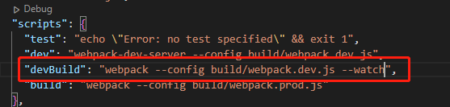

<!--
 * @Author: mengbing mengbingg@outlook.com
 * @Date: 2022-11-14 09:51:59
 * @LastEditors: mengbing mengbingg@outlook.com
 * @LastEditTime: 2022-11-25 15:51:15
 * @Descripttion: 
-->
# vue项目中的性能优化

## 前端通用性能优化
1. 减少http请求
   - 合并js/css文件
   - 使用雪碧图、字体图标等
2. 静态资源尽量使用CDN、nginx做缓存处理
3. CSS文件放在头部，js文件放在底部
4. 对图片进行优化
   - 图片懒加载（v-lazy）
   - 使用雪碧图、字体图标
   - 尽可能使用css3代替图片
5. 减少页面的重绘重排
   - 定义：
     - 重绘：就是重新绘制(repaint)，是在一个元素的外观被改变所触发的浏览器行为,浏览器会根据元素的新属性重新绘制,使元素呈现新的外观。
     - 重排：就是重新排列(reflow)，当渲染树的一部分必须更新并且节点的尺寸发生了变化,浏览器会使渲染树中受到影响的部分失效,并重新构造渲染树。
   - 实现：
     - 使用js修改样式时，尽量通过替换class来改变样式
     - 尽量缓存DOM查询
        ```js
        // 不做缓存
        for(let i = 0; i < document.getElementsByTagName('p').length; i++) {
        
        }
        
        // 缓存
        let p = document.getElementsByTagName('p')
        let length = p.length
        for(let i = 0; i < length; i++) {
        
        }
        ```
     - 将批量操作节点，换成一次性操作
        ```js
        let flagment = document.createDocumentFragment()
        
        for(let i = 0; i < 100; i++) {
            let li = document.createElement('li')
            li.innerHTML = `this is item${i}`
            flagment.appendChild(li)
        }
        
        document.getElementById("wrap").appendChild(flagment)
        ```
6. 使用事件委托
   - 概念：即是把原本需要绑定在子元素的响应事件委托给父元素，让父元素担当事件监听的职务。事件代理的原理是DOM元素的事件冒泡
   - 好处：
     - 可以减少事件注册，节省内存占用
     - 实现事件的动态绑定
7. 防抖节流
   - 防抖：
     - 概念：指触发事件后在 n 秒内函数只能执行一次，如果在 n 秒内又触发了事件，则会重新计算函数执行时间
     - 应用：网站的搜索框通过输入文本框的内容实时检索数据
     - 例子：电梯第一个人进来后，等待15秒。如果过程中又有人进来，15秒等待重新计时，直到15秒后开始运送，这是防抖
   - 节流：
     - 概念：指触发事件在 n 秒中只能执行一次函数，如果在 n 秒内又触发了事件，则不会执行直接return
     - 应用：页面滚动、窗口调整
8. 尽量使用js的原生操作
9. 降低css选择器的复杂度：浏览器读取选择器是从右往左读取的
   ```css
   .box .header .title {
      ...
   }
   ```
10. 长列表优化
    - 大数据量优化：
      - 前后翻页：适用于管理系统
      - 上下滚动：适用于网站
    - 长列表
      - 问题：当滚动屏数过多，页面上就会堆积大量的DOM元素，而DOM元素的渲染十分消耗性能
      - 解决：虚拟列表
    - 虚拟列表：
      - 原理：只对可见区域进行渲染，对非可见区域中的数据不渲染或部分渲染

## vue代码层面优化
1. v-if和v-show的合理使用
2. v-for加key（避免和v-if同时使用）
   - key的作用：提高VDom的更新效率，同时能正确识别节点，避免造成渲染错误
3. 异步组件/路由懒加载
4. keep-alive
   - 作用：用于包裹动态组件、多条件切换的子组件时，会缓存不活动的组件实例，而不是销毁它们
5. data层级不要太深（深度监听时递归次数太多）
6. 组件销毁时，清除自定义事件、全局事件、全局对象等

## webpack层面优化
### 优化构建速度
1. 优化babel-loader，开启Babel缓存
   - 优点：开启babel缓存，之后的 webpack 构建，将会尝试读取缓存，来避免在每次执行时，可能产生的、高性能消耗的 Babel 重新编译过程
   
2. IgnorePlugin和noParse
   - IgnorePlugin：忽略打包第三方包中指定目录下的文件，避免引入多余的包
   - noParse：忽略指定文件的解析
   - 区别：
     - IgnorePlugin 直接就将符合匹配条件的模块，不再进行引入，代码中没有（打包出的文件大小不同）
     - noParse 该引入还是会引入，只是不参与loader或webpack的解析（打包时间不同）
3. happyPack：开启多进程打包
   - 工作机制：Webpack将资源的处理任务交给了HappyPack，再由HappyPack在内部线程池中进行任务调度，分配对应的Loader来处理这个资源，最后HappyPack把处理结果返回给Webpack并输出到目的路径。通过这一系列操作，将原本都在一个Node.js线程内的工作，分配到了不同的进程中并行处理
4. ParallelUglifyPlugin：开启多进程压缩js
5. 自动刷新
   - 定义：代码修改后自动重新打包，并刷新页面
   - 实现：
     - 命令行添加`--watch`
        
     - 脚本中设置`watch: true`属性
   - 缺点：
     - 一个文件变更，会重新打包整个项目
     - 整个网页刷新，会丢失页面中的状态
6. 热更新

### 优化代码产出效率
1. 小图片使用base64编码
2. 打包bundle文件名使用hash值
3. 提取压缩css
4. 提取公共代码/第三方代码
5. 使用production模式
   - 自动开启代码压缩
   - 自动删除调试代码（console.log/warning）
   - 自动开启Tree-Shaking
   - 自动关闭sourceMap
     - 作用：关联打包文件和源代码，实现自动定位
     - 原因：生成map文件，会使得打包体积变大，同时线上环境中生成map，别人就可以直接定位到源代码，可以了解到你的代码逻辑，不安全
6. Scope Hoisting（范围提升）
   - 作用：将**符合条件**的多个模块打包到同一个函数空间内，可以让打包后的代码更小，运行更快
      - 打包前：
         
      - 打包后：
         
   - 好处：
     - 减少函数频繁的创建、销毁，减少内存消耗
     - 多个函数的合并减少了代码量
   - 配置：
     - 开启production模式
     - 使用`optimization.concatenateModules`配置项
   - 模块合并规则：
     - 导入内容必须由esm静态导入
     - 一个模块被多个chunk引用，为了避免重复打包，同样也会失效
