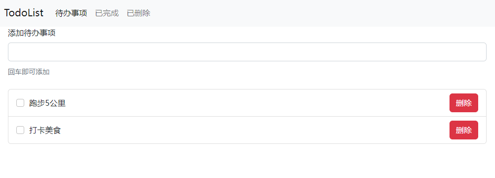
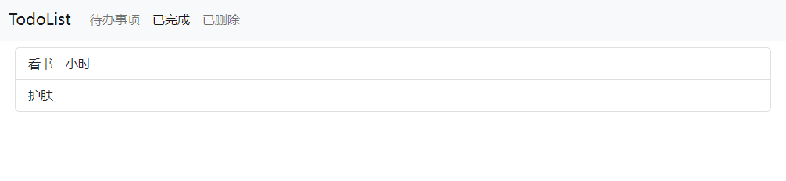
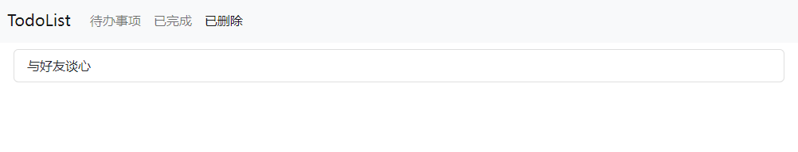
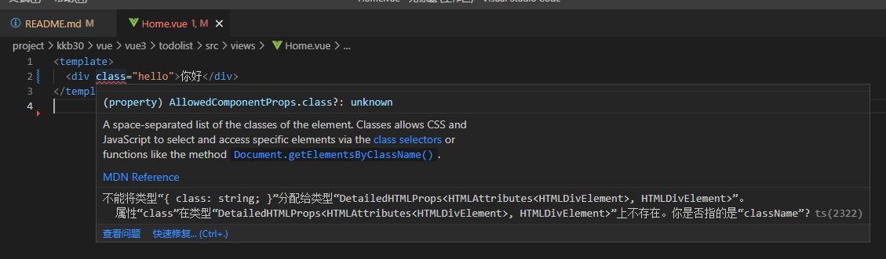

<!--
 * @Author: mengbing mengbingg@outlook.com
 * @Date: 2022-08-24 15:39:46
 * @LastEditors: mengbing mengbingg@outlook.com
 * @LastEditTime: 2022-08-24 17:59:09
 * @Descripttion: 
-->
### vue3实现一个todolist
#### 项目说明
1. css框架：bootStrap（在public/index.html文件中通过link标签引入bootStrap.min.css的CDN地址）
2. vue-cli版本：@vue/cli 4.5.19
2. 实现效果：
    - 待办事项
    
    - 已完成
    
    - 已删除
    

#### 实现步骤：
1. 创建项目：
```
vue create todolist
```
2. 


#### 遇到的问题
1. template中标签上使用class时，ts报错

